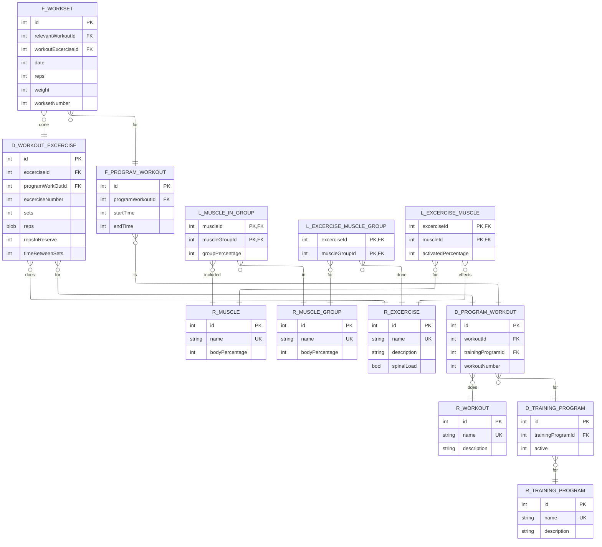

# @fbgfi/workout_analyzer

## Data model

```mermaid
---
config:
  layout: elk
---
erDiagram
    R_MUSCLE {
      int id PK
      string name UK
      int bodyPercentage
    }
    R_MUSCLE_GROUP {
      int id PK
      string name UK
      int bodyPercentage
    }
    R_EXCERCISE {
      int id PK
      string name UK
      string description
      bool spinalLoad
    }
    R_WORKOUT {
      int id PK
      string name UK
      string description
    }
    R_TRAINING_PROGRAM {
      int id PK
      string name UK
      string description
    }

    D_TRAINING_PROGRAM {
      int id PK
      int trainingProgramId FK
      int active
    }
    D_TRAINING_PROGRAM }o--|| R_TRAINING_PROGRAM : for
    D_PROGRAM_WORKOUT {
      int id PK
      int workoutId FK
      int trainingProgramId FK
      int workoutNumber
    }
    D_PROGRAM_WORKOUT }o--|| R_WORKOUT : does
    D_PROGRAM_WORKOUT }o--|| D_TRAINING_PROGRAM : for
    D_WORKOUT_EXCERCISE {
      int id PK
      int excerciseId FK
      int programWorkOutId FK
      int excerciseNumber
      int sets
      blob reps
      int repsInReserve
      int timeBetweenSets
    }
    D_WORKOUT_EXCERCISE }o--|| R_EXCERCISE : does
    D_WORKOUT_EXCERCISE }o--|| D_PROGRAM_WORKOUT : for

    
    F_WORKSET {
      int id PK
      int relevantWorkoutId FK
      int workoutExcerciseId FK
      int date
      int reps
      int weight
      int worksetNumber
    }
    F_WORKSET }o--|| D_WORKOUT_EXCERCISE : done
    F_WORKSET }o--|| F_PROGRAM_WORKOUT : for
    F_PROGRAM_WORKOUT {
      int id PK
      int programWorkoutId FK
      int startTime
      int endTime
    }
    F_PROGRAM_WORKOUT }o--|| D_PROGRAM_WORKOUT : is

    L_MUSCLE_IN_GROUP {
      int muscleId PK,FK
      int muscleGroupId PK,FK
      int groupPercentage
    }
    L_MUSCLE_IN_GROUP }o--|| R_MUSCLE : included
    L_MUSCLE_IN_GROUP }o--|| R_MUSCLE_GROUP : in
    L_EXCERCISE_MUSCLE_GROUP {
      int excerciseId PK,FK
      int muscleGroupId PK,FK
    }
    L_EXCERCISE_MUSCLE_GROUP }o--|| R_EXCERCISE : done
    L_EXCERCISE_MUSCLE_GROUP }o--|| R_MUSCLE_GROUP : for
    L_EXCERCISE_MUSCLE {
      int excerciseId PK,FK
      int muscleId PK,FK
      int activatedPercentage
    }
    L_EXCERCISE_MUSCLE }o--|| R_EXCERCISE : effects
    L_EXCERCISE_MUSCLE }o--|| R_MUSCLE : for

```