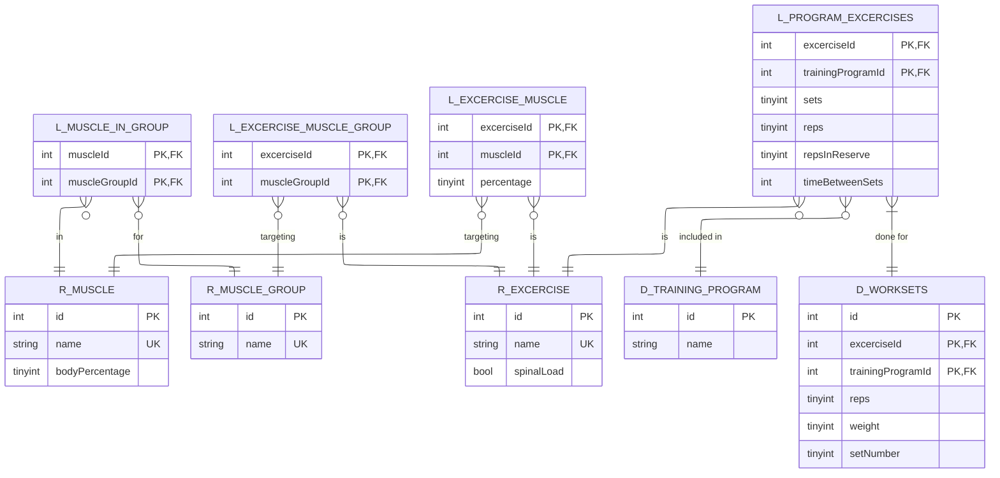

# @fbgfi/workout_analyzer

## Data model

```mermaid
---
config:
  layout: elk
---
erDiagram
    R_MUSCLE {
      int id PK
      string name UK
      tinyint bodyPercentage
    }
    R_MUSCLE_GROUP {
      int id PK
      string name UK
    }
    R_EXCERCISE {
      int id PK
      string name UK
      bool spinalLoad
    }

    D_TRAINING_PROGRAM {
      int id PK
      string name
    }
    D_WORKSETS {
      int id PK
      int excerciseId PK,FK
      int trainingProgramId PK,FK
      tinyint reps
      tinyint weight
      tinyint setNumber
    }

    L_MUSCLE_IN_GROUP {
      int muscleId PK,FK
      int muscleGroupId PK,FK
    }
    L_MUSCLE_IN_GROUP }o--|| R_MUSCLE_GROUP : for
    L_MUSCLE_IN_GROUP }o--|| R_MUSCLE : in

    L_EXCERCISE_MUSCLE_GROUP {
      int excerciseId PK,FK
      int muscleGroupId PK,FK
    }
    L_EXCERCISE_MUSCLE_GROUP }o--|| R_MUSCLE_GROUP : targeting
    L_EXCERCISE_MUSCLE_GROUP }o--|| R_EXCERCISE : is

    L_EXCERCISE_MUSCLE {
      int excerciseId PK,FK
      int muscleId PK,FK
      tinyint percentage
    }
    L_EXCERCISE_MUSCLE }o--|| R_MUSCLE : targeting
    L_EXCERCISE_MUSCLE }o--|| R_EXCERCISE : is

    L_PROGRAM_EXCERCISES {
      int excerciseId PK,FK
      int trainingProgramId PK,FK
      tinyint sets
      tinyint reps
      tinyint repsInReserve
      int timeBetweenSets
    }
    L_PROGRAM_EXCERCISES }o--|| D_TRAINING_PROGRAM : "included in"
    L_PROGRAM_EXCERCISES }o--|| R_EXCERCISE : is
    L_PROGRAM_EXCERCISES }|--|| D_WORKSETS : "done for"


```